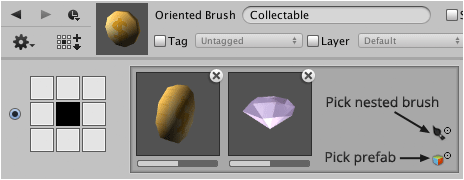

Many variations can be added to each orientation of an oriented brush when desired. There
are two kinds of variation; prefabs and nestable brushes. When it comes to nestable
brushes the most frequently used kind are tileset brushes.

## Steps

1. Right-click the oriented brush that you would like to add a variation to using the
   **Brush** palette and then select **Show in Designer...** from the context menu.

2. Click the small circle at the lower right of the orientation to select one or more
   variations to add.

   

   When the object browser is visible multiple variations can be added by single clicking
   the ones that you would like to add. Double-clicking will add a single variation and
   close object selector window.

   >
   > **Tip** - Prefabs can also be dragged from the **Project** window and brushes can be
   > dragged from the **Brush** palette and then dropped onto the orientation.
   >
