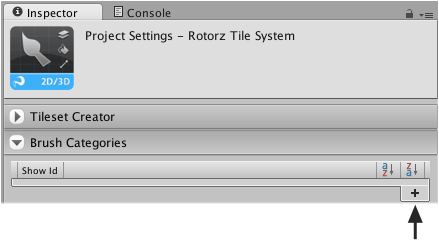
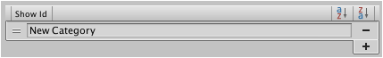

Brush categories can be added using the 'rotorz/unity3d-tile-system' project settings
asset using the **Inspector**.

## Steps

1. Select menu **Edit | Project Settings | Rotorz Tile System**.

   The "Project Settings" configuration asset for the 'rotorz/unity3d-tile-system' package
   should then be selected in the **Inspector**:

   

2. Input a label for the category.

   
