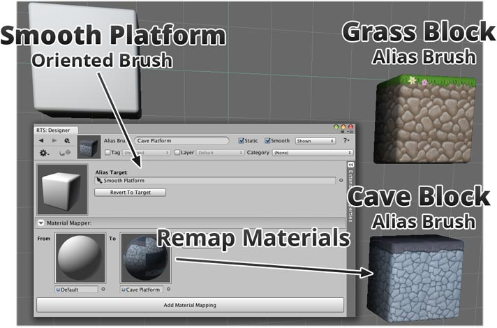

Alias brushes allow you to define new variations of existing brushes such as remapping
materials (effectively allowing you to reskin the target brush) or override the values of
certain properties.

