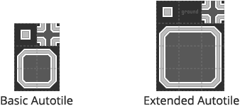
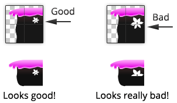

The artwork of an autotile comprises of several key tiles that are each divided into 4
sub-tiles. These sub-tiles can then be automatically mixed and matched to form tiles that
better fit other orientations.

You can design the artwork of an autotile using a regular graphics package. This artwork
can then be selected when you create the autotile tileset. An atlas texture will be
generated automatically from your autotile artwork upon creating the tileset. The
generated atlas is saved as a PNG file which can be modified using a graphics package if
desired.

>
> **Remember** - The atlas of an autotile must be regenerated whenever changes are made to
> the input artwork so that any modifications are realized.
>

When designing artwork for an autotile it is important to keep detailed contained within
its respective sub-tile. The "Bad" tile in the following example demonstrates a corner
tile where the flower overlaps two sub-tiles:

>
> **Tip** - The larger white flower could be added to the "upper left" corner tile
> manually by modifying the generated atlas texture instead than placing it within the
> input autotile artwork. Although any such manual modiications will be lost if the
> autotile atlas is regenerated.
>

## Basic Layout

The 'basic' autotile layout has 6 key tiles each subdivided into 4 sub-tiles that can
then be automatically pieced together to form 46 tiles.

>
> **Remember** - Tiles can be of any even size. Borders can be automatically added to
> generated tiles but must not be added manually to the input artwork.
>

## Extended Layout

The extended autotile layout has dedicated corner and edge tiles allowing you to add
greater detail and define rounder edges. The layout consists of 12 key tiles that are
subdivided into 4 sub-tiles to form an output atlas of 47 tiles.

>
> **Remember** - Tiles can be of any even size. Borders can be automatically added to
> generated tiles but must not be added manually to the input artwork.
>
