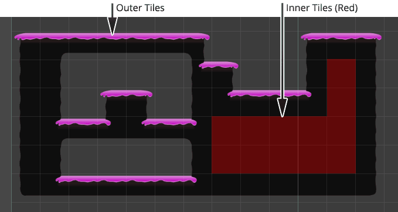

Colliders are often wasted on inner tiles that cannot be reached. Autotile brushes allow
you to specify whether a collider is added for inner and/or outer tiles allowing you to
avoid adding unnecessary colliders.

Outer tiles cover the perimeter of an area of tiles; inner tiles are those that are
entirely surrounded by other related tiles:

>
> **Tip** - Colliders come at a cost and should only be added when absolutely needed. The
> solid flag will typically not incur any overhead, though this will depend upon how you
> have chosen to utilize it.
>
