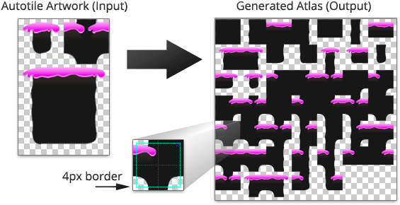

Tile artwork for each available orientation is automatically pieced together from the
input autotile artwork. Borders can be automatically added around each tile to counteract
the effects of edge bleeding.

