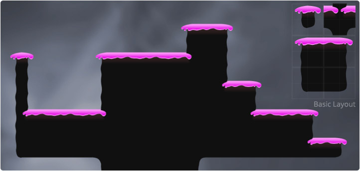

When designing tiles for things like walls, paths and platforms the artist will often need
to produce edge pieces and corner pieces. The design process becomes inherently more
complicated when inner joins are needed due to the quantity of permutations that are
introduced. Autotiles provide an easier way for artists to create such tilesets.

