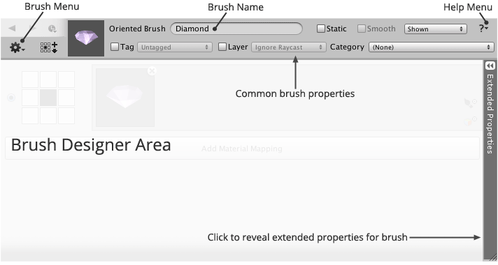

Each type of brush has its own specialized designer interface exposing relevant commands
and properties. Common properties are shown along the top of the interface whilst more
advanced options are tucked away until needed.

Common Properties
: Properties common to most brush types which are used frequently.

Brush Designer Area
: Provides the controls needed to modify the selected brush. Some designers are broken
  down into further sections which can be toggled.

Extended Properties
: Advanced or less commonly used options which are hidden by default which can be toggled
  by clicking the caption area.
