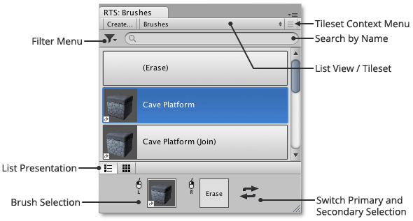
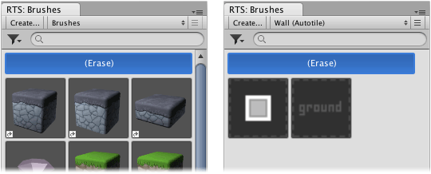
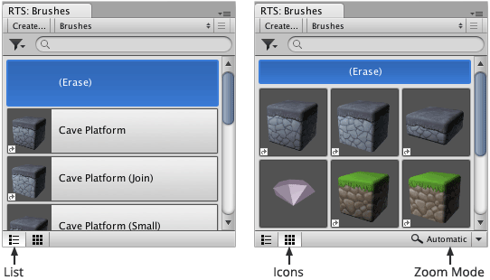
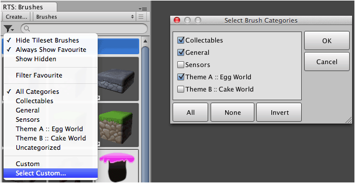
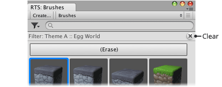
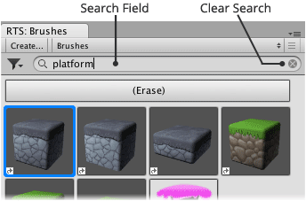

Displays list of brushes allowing selection of primary and secondary brush for use with
selected tool. Primary brush selection can be edited when designer window is shown.

This interface can be displayed via the tool menu ** |
Editor Windows | Brushes**.

## List View / Tileset

Allows you to specify whether general brushes or tileset brushes are to be viewed in the
brushes list. For convenience **Erase** is available from all views.

The brush palette contains two types of view:

- **Brushes** - General list of brushes where tileset brushes are usually hidden (unless
  favorited or **Hide Tileset Brushes** is deselected from filter menu).

- **Tileset** - Brushes from a specific tileset.

>
> **Tip** - Brushes that are not intended to be used directly can be hidden using the
> brush designer. Master brushes are not shown in the brush palette.
>

## List Presentation

Brushes can be shown as a simple list of labelled thumbnails or alternatively as a gallery
of icons. Presentation can be selected using buttons located at lower left of brush list.

>
> **Tip** - Hover mouse pointer over brush to reveal its name for icons presentation.
>

### Zoom Mode
			
Allows you to control how brush thumbnails are scaled when icons presentation is used by
selecting one of the following modes:

- **Automatic** (Default) - Use tile size when a tileset is active, otherwise adjust zoom
  to make use of the available space.

- **Best Fit** - Adjust zoom to make use of the available space.

- **Custom** - Displays slider allowing user to manually adjust zoom.

##  Filter Menu

The filter menu contains a selection of options allowing you to control the way in which
brushes are filtered. Brushes can also be organized into categories which can then be
quickly filtered.

### Filter Options

Upper part of filter menu contains the following options:

- **Hide Tileset Brushes** - Tileset brushes are only shown when a tileset is selected by
  default, though they can be shown in other views by deselecting this option.

- **Always Show Favorite** - Tileset brushes are hidden from the brushes view when the
  prior option is selected. However, this option allows you to force favorited tileset
  brushes to be shown regardless.

- **Show Hidden** - Occasionally brushes are hidden so that they do not appear in the
  brush palette; usually when they are not intended for direct usage. This option allows
  you to temporarily reveal hidden brushes so that you can edit them using the designer.

- **Filter Favorite** - Only favorited brushes will be shown when selected.

### Filtering by Category

Lower part of filter menu allows brushes to be filtered by custom categories that are
defined using the brush designer. Category filtering options will only appear when at
least one brush category has been defined:

- **All Categories** - Shows brushes from all categories.

- **Uncategorized** - Shows brushes which have not been categorized.

- Select category name to show brushes from that category.

- **Select Custom...** - A custom pick of categories.

- **Custom** - Restores previous custom category selection.

### Clear Active Filter

To clear filter simply click "X" button as illustrated below:

## Searching Brush Names

The search field allows brushes to be filtered by name. When specified only brushes whose
name contains the search text will be shown. Search can be cleared by clicking the small
cross button.

>
> **Tip** - This feature can be used in conjunction with category filtering to make it
> even easier to find the brushes that you need.
>

## Keyboard Shortcuts

The brush palette includes two keyboard shortcuts allowing you to quickly set the primary
or secondary brush and begins painting if tool is not already selected.

- **Ctrl + Left Click** - Set primary brush and begin painting.

- **Ctrl + Right Click** - Set secondary brush and begin painting.
