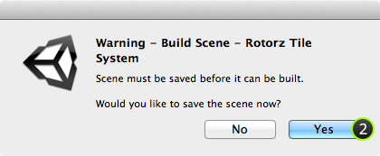
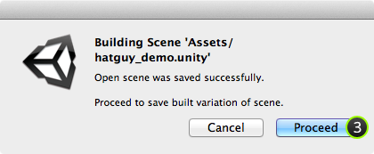
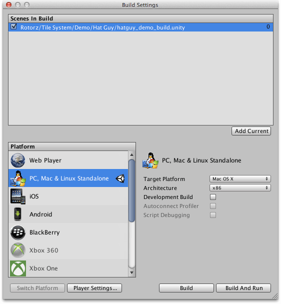

'rotorz/unity3d-tile-system' provides an option allowing you to build all of the tile
systems in the current scene which will then be saved to a separate scene file. Original
scene should be retained so that you can make changes and then rebuild.

>
> **Caution** - Current scene must be saved before it can be built. Also note that
> previous build will be lost when overwriting an existing scene file.
>

## Steps

1. Select menu ** | Build Scene...**

   The following window should appear:

   

2. Select **Yes** to save current scene before attempting to build optimized version.

   >
   > **Caution** - Undo/redo history will be lost during build process. Do not proceed if
   > you do not wish to save your scene.
   >

   You should then be prompted with the following message:

   

3. Select **Proceed**.

4. Specify output file for optimized version of scene.

5. *(Optional)* Add optimized version of scene to project build.

   1. Open optimized scene using **Project** window.
   
   2. Select menu **File | Build Settings**.
   
   3. Click **Add Current** button.

      You should then see the path of your optimized scene listed:

      
