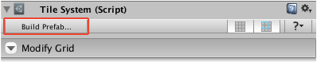
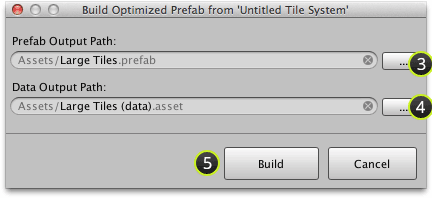

Sometimes it is useful to save optimized versions of tile systems as prefabs which can
then be composed to make scenes. Additional mesh assets will be generated when tiles are
combined.

## Prerequisite

Ensure that **Inspector** window is shown by selecting **Window | Inspector**.

## Steps

1. Select your tile system.

2. Click **Build Prefab...** command at start of **Tile System** interface:

   

   The following window should then appear:

   
					

3. Click first **...** button to specify output path for generated prefab.

   >
   > **Note** - This will automatically pre-fill the data output path. You may skip the
   > following step if you are happy with the automatically filled path.
   >

4. Click second **...** button to specify output path for generated data asset.

5. Click **Build**.

## Results

Optimized version of tile system should have been saved to prefab with accompanying data
asset whilst the original tile system is left untouched.
