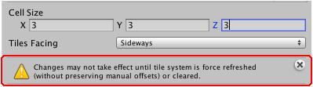
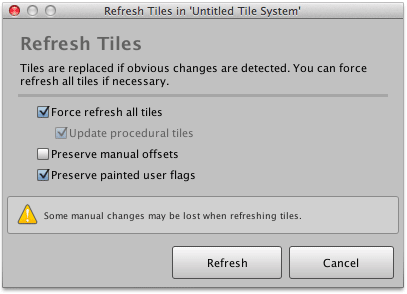

You can change the width, height and depth of tile cells in an existing tile system using
the inspector interface.

>
> **Caution** - Some manual tweaks and changes may be lost including custom added
> components, or tile properties which have been modified using the inspector.
>

## Prerequisite

Ensure that **Inspector** window is shown by selecting **Window | Inspector**.

## Steps

1. Select the tile system that you would like to change.

2. Input the new cell size using inspector.

   You may notice that tile system grid is immediately updated in scene view, though
   existing tiles are not automatically updated.

   A warning message will be shown indicating that some changes will not take effect until
   tile system is force refreshed or cleared. Tiles need to be force refreshed so that
   they are correctly positioned to fit within the updated grid:

   

3. Click **Refresh...** to refresh existing tiles.

   

4. Ensure that both **Force refresh all tiles** and **Update procedural tiles** are
   selected to force tiles to be repainted.

5. Deselect **Preserve manual offsets** so that position and scale of tiles are correctly
   updated.

6. Click **Refresh**.

## Results

Cell size has been updated and all previously painted tiles should have been updated to
reflect this.
