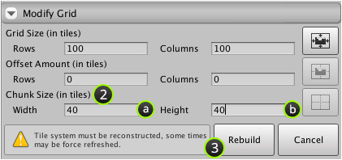

The chunk size of a tile system can be changed using the inspector window which is useful
when optimizing your scenes.

## Prerequisite

Ensure that **Inspector** is shown by selecting **Window | Inspector**.

## Steps

1. Select root game object of the tile system that you would like to change.

2. Input the number of rows and columns to use per chunk using **Inspector**.

   Once changed a message should appear indicating that the tile system must be
   reconstructed using the newly specified chunk size:

   

   >
   > **Caution** - Some tiles may be force refreshed whilst reconstructing tile system.
   > You can abort at this stage by clicking **Cancel**.
   >

3. Click **Rebuild**.
