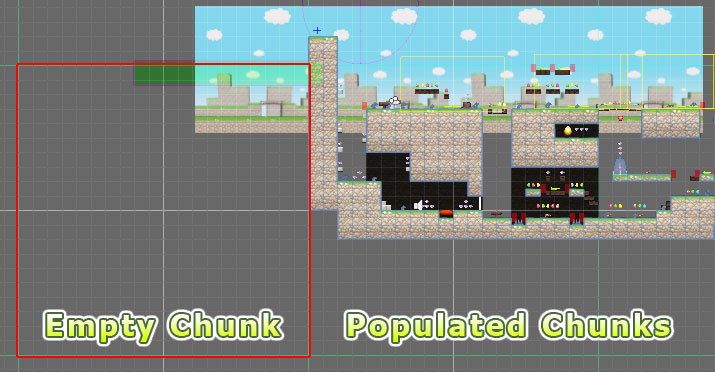

Tiles are mapped using a chunked data structure which helps to avoid memory wastage when
large areas of a tile system remain empty. Custom scripts can access tile data
transparently of the underlying data structure.

Chunks are also home to the meshes generated by procedural tileset brushes. Procedural
meshes are typically generated at runtime since this helps to reduce the file size of your
scenes. There is a build option which allows you to pre-generate such meshes if preferred.

Tile meshes can be combined by material on a per chunk basis helping you to reduce the
total number of draw calls in your scene. This is similar to static batching and can help
to improve performance, especially on mobile platforms. Tiles painted using procedural
tilesets are not combined since they are effectively already combined.

>
> **Tip** - Whilst tile meshes can be combined on a per-chunk basis, it is possible to
> specify a different chunk size for the mesh combiner if desired (see [Build Options]).
>

Please remember that there is a maximum of around 64K vertices per mesh which means that
the chunk size must be chosen accordingly. For example, the maximum chunk size for a
procedural mesh has an area of 100x100 tiles (though not necessarily square, it could be
10x1000).

## Visualizing Chunks

Chunk boundaries of the active tile system are outlined by default. This can help you to
make better use of resources when planning your game.

The visualization of chunk boundaries can be hidden if you find them distracting by
deselecting **Display chunk boundaries** (see [User Preferences]).

[Build Options]: ./Tile-System-Build-Options.md
[User Preferences]: ./User-Preferences.md
