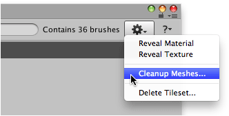
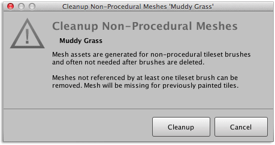

Each non-procedural tileset brush is accompanied by a pre-generated mesh asset. These mesh
assets can be removed using the cleanup command when they are not referenced by any
tileset brushes.

## Prerequisite

If you have switched tileset brushes from non-procedural to procedural then any tiles that
were painted prior will be affected when the 'unused' mesh assets are removed. Such tiles
should be refreshed so that they are replaced with procedural tiles instead.

## Steps

1. Select tileset using **Brush** palette and select menu command
   ** | Show in Designer...**.
		

2. Select menu command ** | Cleanup Meshes...**.

   

   The following confirmation window should appear:

   

3. Click **Cleanup**.
