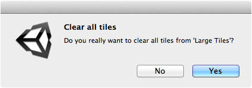

Tiles and chunks can be cleared from a tile system using the tile system inspector or via
the context menu in the scene palette.

## Prerequisite

Ensure that **Inspector** window is shown by selecting **Window | Inspector**.

## Steps

1. Select your tile system.

2. Click **Clear...** button in tile system inspector.

   A confirmation message should appear:

   

3. Select **Yes** to clear all tiles and chunks.
