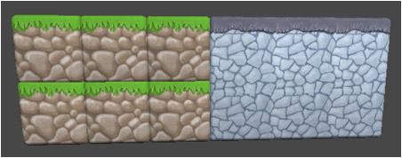
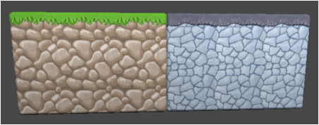
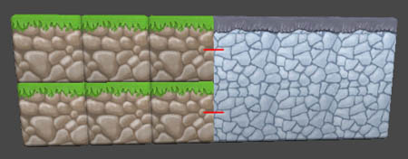
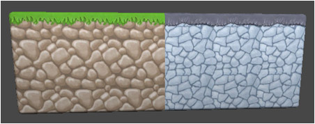
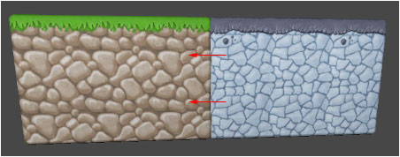

The way in which tiles join with one another can be controlled by altering the way in
which they coalesce.

**None**
: Do not attempt to join adjacent tiles.

  

  - **Grass Block** with **Coalesce Mode | None**
  - **Cave Block** with **Coalesce Mode | Own**

**Own** (Default for new brushes)
: Only join adjacent tiles of same brush.

  

  - **Grass Block** with **Coalesce Mode | Own**
  - **Cave Block** with **Coalesce Mode | Own**

**Other**
: Do not join with adjacent tiles of own brush, but join with tiles that were painted
  using any other brush.

  

  - **Grass Block** with **Coalesce Mode | Other**
  - **Cave Block** with **Coalesce Mode | Any**

  >
  > **Note** - Red lines illustrate that brushes join with one another.
  >

**Any**
: Join with adjacent tiles of own brush and any other brush.

  

  - **Grass Block** with **Coalesce Mode | Any**
  - **Cave Block** with **Coalesce Mode | Any**

**Groups**
: Only join with adjacent tiles that were painted using brush of zero or more specific
  groups.

  

  - **Grass Block** with **Coalesce Mode | Groups** (in group #1 with group #1)
  - **Cave Block** with **Coalesce Mode | Groups** (in group #1 with group #1)

**Own And Groups**
: Join with adjacent tiles that were painted using same brush or brush of zero or more
  specific groups.

  

  - **Grass Block** with **Coalesce Mode | Own** (in group #1)
  - **Cave Block** with **Coalesce Mode | Own And Groups** (with group #1)
