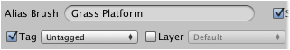

Some properties are common between brush types which are located at top of brush designer
interface.

## Brush Name

Used when naming the brush asset and is presented in brush lists.

>
> **Tip** - Do not forget to click the **Rename** button once you have finished altering
> the brushes name.
>

## Static

Indicates whether tiles painted using brush can be optimized when building tile systems.

See [Optimization] for more information.

## Smooth

Indicates whether normals of tiles painted using brush should be smoothed when optimizing
tile systems. This can help to avoid lighting artifacts where tiles join one another.

>
> **Note** - Smoothing can only be enabled for static brushes.
>

## Visibility

Allows brushes to be hidden or favored within brush list views, most specifically within
the **Brushes** palette.

- **Shown** - Shown by default.

- **Hidden** - Hide from brush lists (except designer window).

- **Favorite** - Favorite brushes are shown plus can be filtered, and favored tileset
  brushes will appear under the **Brushes** list view.

## Tag and Layer

Specify tag and layer that should be assigned to painted tiles.

These properties must be [explicitly overridden] for certain brush types. With oriented
brushes this is useful because it allows the user to decide whether to override values for
all tiles, or alternatively allows the user to define values on a per tile basis.

## Category

Specifies the category that the brush belongs to. Categories help you to organize your
brushes so that they are easier to scroll through when you have large tile sets.

You can define categories using the category manager which can be accessed via by
selecting **Manage Categories** from the popup menu (see [Brush Categories]).

[Brush Categories]: ./Brush-Categories.md
[explicitly overridden]: ./Overriding-Properties.md
[Optimization]: ./Tile-System-Optimization.md
