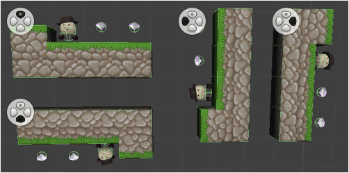
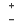
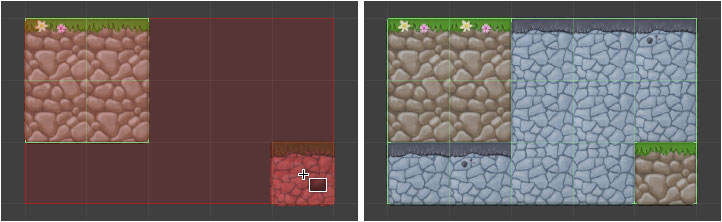
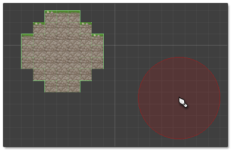

Some options are common to a number of tools.

## Rotation Selector

Paint tiles with simple rotation at 90 degree intervals. This feature works with 2D and 3D
tiles. Simply click on the button representing the desired rotation to select it.

**Shortcut Keys:**

- **M** - Reset to 0 degrees
- **,** (comma) - Rotate anti-clockwise by 90 degrees
- **.** (period) - Rotate clockwise by 90 degrees

The following image demonstrates tiles which have been painted with various rotation
selections:

>
> **Tip** - Behavior of rotation is affected by the default rotation of a tile. In the
> case of 3D tiles this can be adjusted by setting the prefab offset.
>

##  Randomize Variation

Oriented brushes allow you to specify multiple variations for each orientation which can
be picked at random when painting.

##  Shift to Next or Previous Variation

Sometimes it is useful to shift to the next or previous variation before painting or
plopping a tile (i.e. cycle before painting).

**Shortcut Keys:**

- **+** - Shift to next variation
- **-** - Shift to previous variation
- **0** - Reset shift to zero
- **Alt + Mouse Wheel** - Shift to next or previous variation.

##  Paint Around Existing Tiles

Tiles will be painted around existing tiles when this option is selected. This option does
not apply when erasing tiles.

## Nozzle Shape

Shape of nozzle to use when painting tiles:

-  Round Nozzle
-  Square Nozzle

## Nozzle Radius / Nozzle Size

Radius or size of nozzle can be adjusted using a slider depending upon which nozzle shape
is selected. Nozzle area is highlighted when painting like illustrated below:

**Shortcut Keys:**

- **[** - Decrease radius or size of nozzle
- **]** - Increase radius or size of nozzle
- **Ctrl + Mouse Wheel** - Increase or decrease radius or size of nozzle
