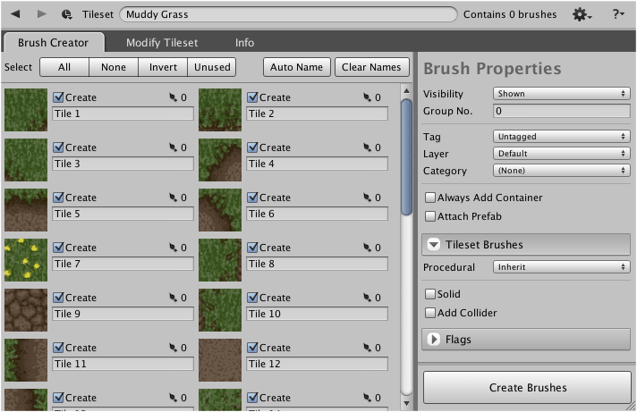

Multiple brushes can be created in bulk by selecting and naming each of the required
tiles. The same selection of properties will be applied to each created brush.

## Steps

1. Select tileset using **Brush** palette and select menu command
   ** | Show in Designer...**.

2. Select and name tileset brushes as desired.

   For each desired tile:
   
   1. Select **Create** tick box.

   2. Input unique name for brush.

   >
   > **Tip** - Multiple tiles can be selected and named using the utility buttons at the
   > top of the brush creator interface.
   >

   You should then have something like the following:

   

3. (Optional) Adjust [default properties] for brush.

4. Click **Create Brushes** button.

## What to do next

The properties of each brush that was created can now be individually customized as needed.

[default properties]: ./Tileset-Brush-Creator-Tab.md
