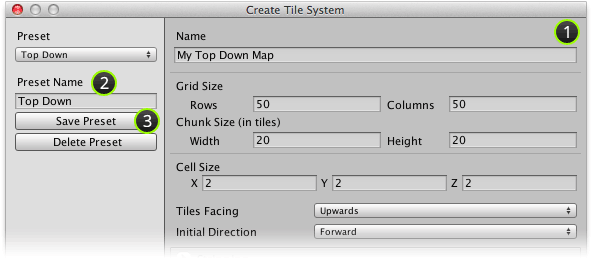

The parameters used to create a tile system can be saved into a preset which can later be
reused when creating a tile system.

## Prerequisite

Ensure that **Create Tile System** window is displayed (see [Creating a Tile System]).

## Steps

1. Input tile system creation parameters as required for preset.

2. Input name for preset.

3. Click **Save Preset** button to save preset.

## Result

New preset should have been created and selected in **Preset** drop-down box.

[Creating a Tile System]: ./Creating-a-Tile-System.md
