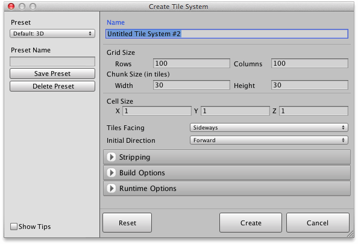

The tile system creation interface can be accessed via the main tool menu allowing you to
define the specifics for your tile system. You can later modify your tile system using the
inspector if desired.

## Steps

1. Select menu command ** | Create Tile System...**.

   - or, click **Create Tile System...** in toolbar of **Scene** palette.

   - or, select **Create | Rotorz Tile System...** menu in **Hierarchy** window.

   The following window should appear:

   

2. Specify a name for your new tile system.

3. Specify the number of rows and columns of tiles in your system.

   >
   > **Caution** - Larger systems will generally consume more memory even when left empty,
   > and if too large may cause the Unity editor to crash.
   >

4. Specify the size of a chunk.

   Optimal chunk size will vary depending upon your requirements. It is often useful to
   experiment with different chunk sizes and then measure performance and resource
   utilization.

   >
   > **Tip** - A chunk size of 100x100 often works well for 2D tile maps.
   >

5. Specify dimensions of a tile cell in world space.

   The way in which tiles are scaled to fit the specified cell size can be defined using
   the brush designer. It is common to define tile prefabs which fill a 1x1x1 unit of
   space so that they can be scaled to fit any user specified cell size (see **Use Cell Size**
   scale mode).

6. Choose appropriate option for **Tiles Facing**.

   Tiles are rotated so that they face away from the tile system making it easier to fine
   tune rotation when when **Apply Prefab Transforms** is used.
   
   Sideways
   : Recommended for side-scrolling maps.

   Upwards
   : Recommended for top-down maps.

7. Review and adjust additional properties as needed.

8. Click **Create**.

## Result

A new tile system should have been added to your scene.

>
> **Tip** - Double-click the name of your new tile system using the scene palette or
> hierarchy window to locate if out of view.
>
