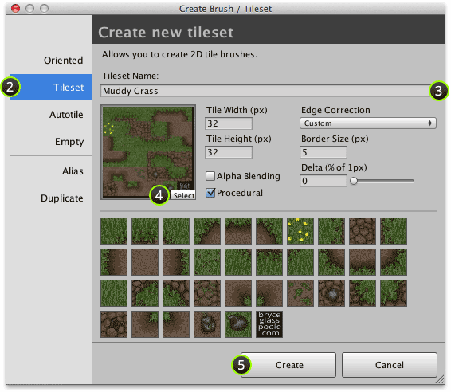
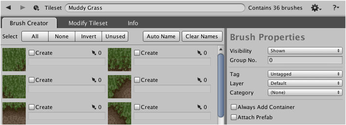

A new tileset can be created by selecting the atlas texture and specifying the tile size
and edge correction method. Tilesets are created using the **Tileset** section the
**Create Brush / Tileset** window.

## Steps

1. Select menu command ** | Create Brush or Tileset...**

2. Ensure that **Tileset** tab is selected.

   

3. Input *unique* name for tileset.

4. Select atlas texture and input tile size and [Edge Correction].

   - **Alpha Blending** - Select when alpha transparency is required to initialize atlas
     material with the shader **Unlit | Transparent**.

   - **Procedural** - See [Procedural and Non-Procedural Tiles] to learn more about this
     parameter.

   >
   > **Note** - Tile previews automatically update when tile size or edge correction
   > parameters are altered. This can help to highlight input errors.
   >

5. Click **Create**.

## Result

Tileset should then be shown in designer:

## What to do next

You will need to create tileset brushes before you are ready to use your new tileset.

[Edge Correction]: ./Edge-Correction.md
[Procedural and Non-Procedural Tiles]: ./Procedural-and-Non-Procedural-Tiles.md
