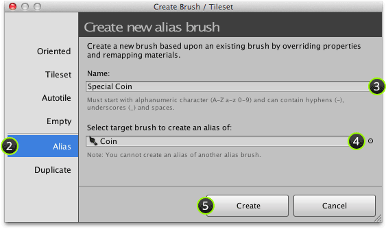
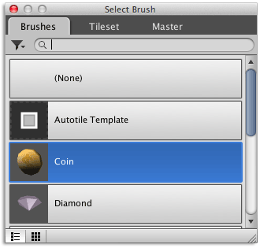
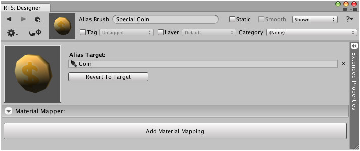

Alias brushes can be created using the create brush window which can be quickly accessed
via context menu of target brush.

## Steps

1. Select menu command ** | Create Brush or Tileset...**

2. Select **Alias** section:

   

3. Input *unique* name for brush.

4. Select target brush to create alias of.

   To do this either click brush field and select brush as demonstrated below or drag and
   drop brush from brush list.

   

5. Click **Create**.

## Result

You should then see something like the following:

