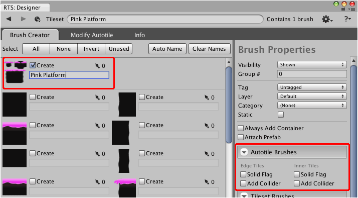

Autotile brushes can be created using the brush creator interface of the tileset designer.

## Steps

1. Select tileset using **Brush** palette and select menu command
   ** | Show in Designer...**.

2. Select and name autotile brush as desired.

   Additional options will appear in the **Brush Defaults** panel allowing you to specify
   autotile-specific details.

   You should then have something like the following:

   

3. (Optional) Adjust [default properties] for brush.

4. Click **Create Brushes**.

[default properties]: ./Tileset-Brush-Creator-Tab.md
