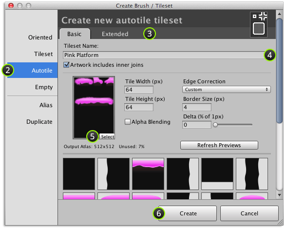
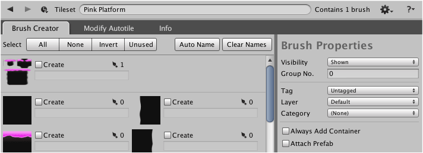

A new tileset can be created by providing the artwork for an autotile and specifying the
tile size and edge correction method using **Autotile** section of **Create Brush / Tileset**
window.

## Steps

1. Select menu command ** | Create Brush or Tileset...**

2. Select **Autotile** section.

   

3. Select tab for the type of autotile artwork that you have.

4. Input *unique* name for tileset.

5. Select autotile artwork and input tile size and [Edge Correction].

   - **Alpha Blending** - Select when alpha transparency is required to initialize atlas
     material with the **Unlit | Transparent** shader.

   >
   > **Note** - Borders can be automatically added for autotile brushes and is usually the
   > better choice. When specifying border size take care to reduce the area of unused
   > atlas space whilst keeping atlas as small as possible.
   >

6. Click **Create**.

## Result

Tileset should then be opened in designer window:

## What to do next

You will need to create autotile brushes and/or tileset brushes before you are ready to
use your new tileset.

[Edge Correction]: ./Edge-Correction.md
