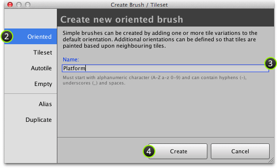
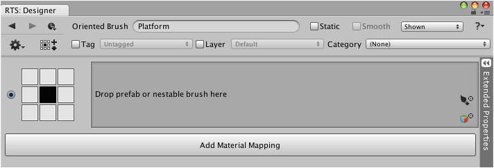

Oriented brushes can be created using the create brush window.

## Steps

1. Select menu command ** | Create Brush or Tileset...**

2. Ensure that **Oriented** tab is selected:

   

3. Input *unique* name for brush.

4. Click **Create**.

## Result

You should then see something like the following:

