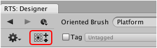
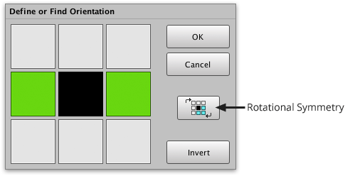

New orientations can be defined by specifying the expected neighboring tiles by toggling
them green or white. The same interface can also be used to quickly find existing
orientations which is useful when working with brushes which have lots of them.

## Steps

1. Right-click brush using **Brush** palette and select **Show in Designer...** from menu.

2. Click **Define or Find Orientation...** (F3) button.

   

3. Select orientation by clicking the squares which surround the centralblack square to
   toggle between white and green. Quickly toggle multiple squares by dragging mouse
   pointer across them.

   - **Black Square** - The tile that you are matching.

   - **Green Square** - Neighboring tile which coalesces with tile.

   - **Cyan Square** - Same as green but indicates rotational symmetry is selected.

   - **White Square** - Empty or neighboring tile which does not coalesce with tile.

   

   >
   > **Tip** - Use **Invert** button to quickly toggle all squares with one click. This
   > can be a time saver when orientation is mostly green!
   >

4. Click **OK** to define new orientation.

   Brush designer will automatically scroll to orientation if it already exists. It is not
   possible to define the same orientation multiple times.
