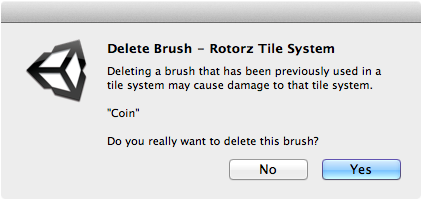

An unwanted brush can be deleted via its context menu in the brush palette or via the
brush menu when brush is shown in designer.

## Prerequisite

Ensure that **Brush** palette is shown by selecting ** |
Editor Windows | Brushes**.

Avoid deleting brush if still referenced by one or more tile systems to avoid causing
unintentional damage. It will no longer be possible to refresh existing tiles that were
painted using brush once deleted. Inability to refresh tiles prevents automatic
orientation and can cause issues when optimizing tile systems.

>
> **Note** - Master brushes can be deleted using the **Project** window.
>

## Steps

1. Right-click on the brush that you would like to delete.

2. Select **Delete Brush...** from context menu.

   A message box will appear to confirm deletion of brush:

   

3. Select **Yes** to delete brush.
