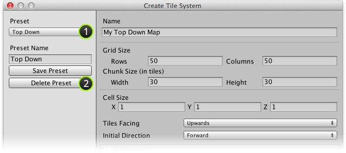
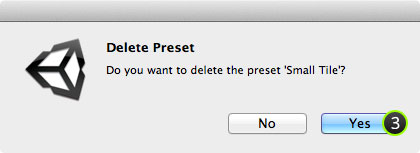

An unwanted preset can be deleted using the **Create Tile System** window by selecting it
and clicking the delete button.

## Prerequisite

Ensure that **Create Tile System** window is displayed (see [Creating a Tile System]).

## Steps

1. Select the preset that you would like to delete using **Preset** drop-down box.

2. Click **Delete Preset** button.

   >
   > **Note** - Deleting a preset will **not** cause any changes to be made to previously
   > created tile systems.
   >

   Confirmation message should then be shown:

   

3. Click **Yes** to delete preset.

## Result

Preset should have been removed with the default preset selected.

[Creating a Tile System]: ./Creating-a-Tile-System.md
