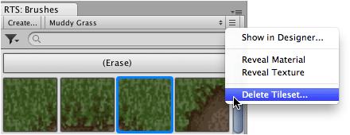
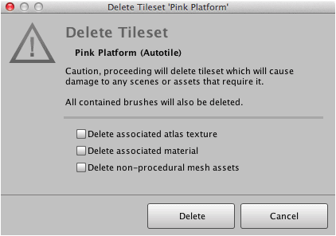

A tileset and all contained brushes can be deleted via the brush palette or alternatively
using the tileset designer interface. Tiles that have been painted using a deleted tileset
will become damaged.

## Options

Related tileset assets can also be removed when deleting a tileset provided that they are
stored within the tileset folder. Choosing to delete these assets will affect the
rendering of previously painted tiles. Retaining these assets will not preserve procedural
tiles.

Delete associated atlas texture
: This option is shown when texture asset is located within same folder as tileset asset.

Delete associated material
: This option is shown when material asset is located within same folder as tileset asset.

Delete non-procedural mesh assets
: This option is shown when pre-generated meshes were generated to support the rendering
  of non-procedural tiles. Previously painted non-procedural tiles will seem to disappear
  though their game objects will still exist.

>
> **Tip** - These assets can be deleted manually at a later time by navigating to the
> tileset folder in your project.
>

## Prerequisite

>
> **Caution** - Deleting a tileset will cause all contained brushes to be deleted also.
> Previously painted tiles will also be affected. This procedure cannot be reversed. This
> might be a good time to backup your project.
>

## Steps

1. Select tileset using **Brush** palette.

2. Select menu command ** | Delete Tileset...**.

   

   The delete tileset confirmation window will then appear which will look something like
   the following:

   

3. Select options as desired.

4. Click **Delete** to delete tileset and all contained brushes.

## What to do next

Tiles previously painted using the deleted tileset will no longer reference the brushes
that were used to paint them. Non-procedural tiles may appear unaffected depending upon
which options you selected when deleting the tileset. Procedural tiles will be affected
the next time they are regenerated.

You should repair tile systems to remove any tiles that were painted using a brush that
nolonger exists.
