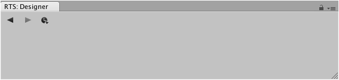

The designer window is a central interface which can be used to modify the active brush or
tileset. Each type of designable object comes with its own specialized interface which can
be quickly accessed via the brush palette.

This interface can be displayed via the tool menu ** |
Editor Windows | Designer**.
