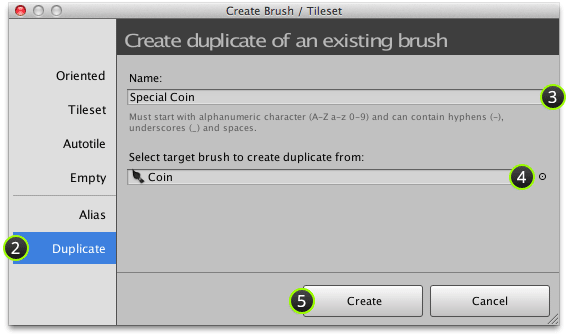
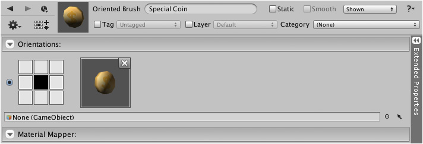

An existing brush can be duplicated using the create brush window which can be quickly
access via the brush's context menu.

## Steps

1. Select menu command ** | Create Brush or Tileset...**

2. Select **Duplicate** section:

   

3. Input *unique* name for brush.

4. Select the target brush to create duplicate from.

   To do this either click brush field and select brush as demonstrated below or drag and
   drop brush from brush palette.

   

5. Click **Create** to duplicate target brush.

## Result

You should then see something like the following:

>
> **Important** - Ensure that duplicate brush is shown in designer before making any changes.
>
