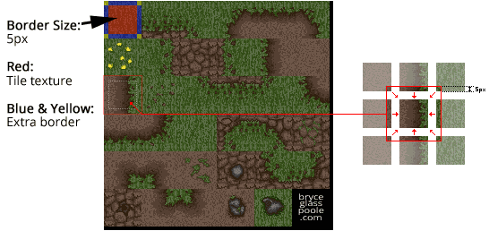
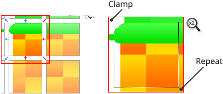
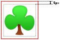

Adding borders around the edges of each tile is one of the most effective ways to reduce
artifacts that are caused by bleeding. This works because the border pixels are blended
with the tile pixels when filtering or mip-mapping is used.

The size of the border that you require will depend upon whether you are using mip-mapping
for your textures. Larger borders allow you to view tiles from a greater range. A border
size of between 1 and 8 pixels is usually adequate.
		
If your tile system is only ever visible to an orthographic camera, and its visual size
never changes, then you can often just disable mip-mapping. Disabling mip-mapping will
also reduce the amount of texture memory required.

>
> **Tip** - Unlike with standard tilesets, borders can be generated automatically when
> creating an autotile tileset.
>

## Adding borders for repeating edges:
			
Borders can be created by copying the pixels of the expected neighboring tiles. This
technique has been applied to all 4 edges and corners for each of the tiles in the
following illustration:

## Clamp non-repeating edges:

For the following tile you might feel tempted to place transparent pixels on its upper and
left edges. Unfortunately doing so would still cause edge bleeding to occur resulting with
a fine transparent line between that tile and the tile above (or to left) of it.

Instead the better solution is to clamp the edge pixels by stretching the edge pixels
outward. In the case of this tile a combination of clamping and repeating is appropriate.

## Surround sprite-like tiles with transparent pixels:

Standalone sprite-like tiles can be surrounded by a border of transparent pixels:

