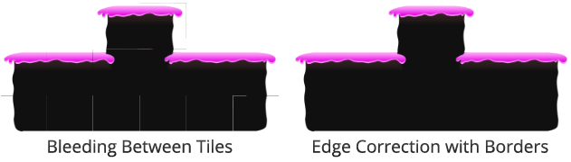
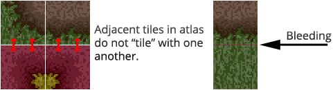

Bleeding will usually occur at the edges of tiles due to texture filtering and/or
mip-mapping. Two popular ways to reduce the visibility of such artifacts is to either
inset UV coordinates by half a texel, or to add borders around the edges of each tile in
your atlas.

As depicted above, lines appear between tiles which often flicker when movement occurs
(camera movement, zooming, tile movement, etc). The effects of edge bleeding can sometimes
be counteracted by carefully packing tiles adjacent to other similar tiles.

## Why does bleeding occur?

Edge bleeding occurs when multiple tiles are packed into an atlas texture because pixels
are incorrectly blended between adjacent tiles.

Each of the following can lead to this undesirable effect:

- Texture filtering

- Mip-mapping

- Lossy texture compression

- Use of Non-Power-Of-Two (NPOT) atlas texture

- Sub-pixel placement of tiles

>
> **Tip** - Where possible avoid using lossy texture compression when working with tileset
> atlas textures. If you switch the texture inspector into advanced mode you can pick from
> a range of texture formats on a per platform basis.
>
