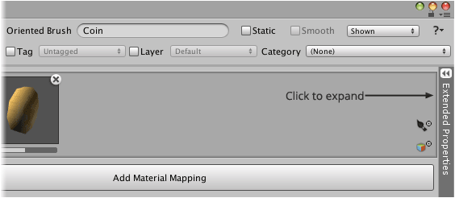
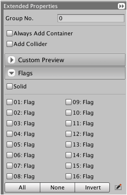

Some extended properties are common between brush types (like group number and flags)
whilst other specialized properties are specific to certain brush types.

By default the extended properties section is hidden. To display these properties click
the **Extended Properties** tab along right of brush designer window as shown below:

## Group No.

Brushes can be grouped which is useful when brushes are coalesced by group. Users may
decide to utilize group numbers for other purposes instead.

For example, tiles painted using an oriented or autotile brush can coalesce with other
tiles within a specific group.

>
> **Note** - Group number is a 32-bit signed integer.
>

## Force Legacy Sideways

Forces the legacy behavior of tile systems with sideways facing tiles for tiles painted
using brush. With the legacy behavior tiles are rotated by 180 degrees around the up axis
so that they face away from tile systems.

The behavior of tile systems with sideways facing tiles was changed in Rotorz Tile System
version 2.2.2 to resolve workflow issues with Unity 4.3 sprites.

Whilst the new behavior is recommended for new projects, it is perfectly fine to continue
to use the legacy behavior. Existing brush assets are automatically configured for the
legacy behavior upon updating from an older version of Rotorz Tile System (pre v2.2.0) so
that they behave consistently.

## Scale Mode

Defines the way in which painted tiles should be scaled.

| Scale Mode                | Description                                   |
|---------------------------|:----------------------------------------------|
| **Dont Touch** (default)  | Leave tile alone! Maintain scale of prefabs.  |
| **Use Tile Size**         | Apply scale from tile size to prefabs.        |
| **Custom**                | Apply custom scale to prefabs.                |

## Always Add Container

Empty game objects are often used as containers for tiles that have attached prefabs or to
hold colliders that are added automatically. This property enables you to force the
creation of empty game objects which can be useful for custom scripting although should be
avoided unless absolutely necessary.

## Flags

Flags can be used in conjunction with user defined scripts and are intended for general
usage. There are 16 unnamed flags plus one called "solid".

The initial state of tile flags can be specified using the brush designer. Flag states are
maintained on a per tile basis and are initialized from brushes upon being painted. Tile
flags can be accessed and modified at runtime by custom scripts if needed (see `TileData`).

In addition to the 16 general purpose flags an additional flag labelled "Solid" is also
provided which is exposed as a named property. The solid flag is also a general purpose
flag which indicates whether a tile should be treated as solid or passable. Custom scripts
can be implemented to utilize the state of this flag to perform tile based collision
detection or pathfinding.

>
> **Note** - Flag states are stored using a 32-bit integer variable using bit masks.
> Additional flags are used internally and are not directly accessible using the API.
>

You can provide your own labels for the 16 general purpose flags which can be specified
for all brushes project-wide or overridden on a per brush basis.
