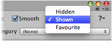

Brushes can be hidden from the brush palette by altering its visibility using the brush
designer. This is useful for intermediary brushes which are not intended for direct usage.

## Steps

1. Select tileset using **Brush** palette and select menu command
   ** | Show in Designer...**.

2. Select **Hidden** from **Visibility** field.

   Field is located in upper right corner of designer interface:

   
