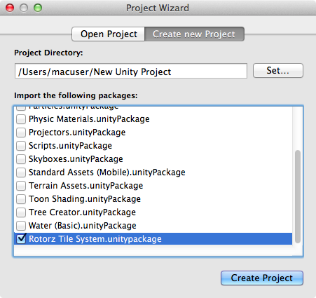

'rotorz/unity3d-tile-system' can be installed by importing its package using the Unity asset
store interface (or alternatively when first creating your project).

## Import Using Asset Store

1. Open asset store **Window | Asset Store**.

2. Expand list of licensed assets.

3. Navigate to 'rotorz/unity3d-tile-system'.

4. Select **Import**.

## Import When Creating Project

Package can also be selected when first creating a project:

