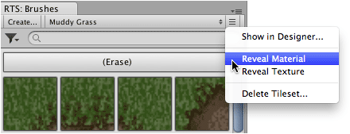

The atlas material that is automatically created for a tileset can be located easily using
the tileset designer. This is useful when you would like to change shader or customize the
material.

## Locate atlas material from tileset designer:

Select menu command ** | Reveal Material**.

Material asset should then be selected and highlighted in **Project** window.

## Locate atlas material using brush palette:

Ensure that brush palette is shown (** | Editor Windows | Brushes**).

1. Choose tileset.

2. Select menu command ** | Reveal Material**.

   

Material asset should then be selected and highlighted in **Project** window.
