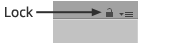

Designer can be locked so that active brush or tileset is retained whilst another brush or
tileset is selected using the brush palette. This is similar to the inspector lock and is
particularly useful when dragging and dropping brushes.

Click lock icon when brush or tileset is shown in designer to toggle:

-  - Not Locked
-  - Locked

>
> **Tip** - You can still navigate between designers using the selection history when
> designer window is locked since this is often quite useful.
>
