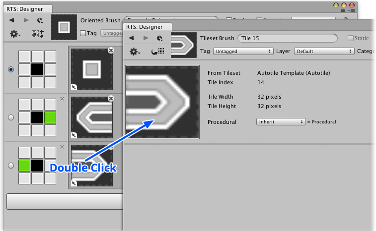

This section explains how to quickly lookup a tile prefab or edit a nested brush when
using the brush designer, which can be a huge time saver when continously switching to and
fro between an oriented brush and its nested brushes.

## Steps

1. Right-click brush using **Brush** palette and select **Show in Designer...** from menu.

2. Double click the thumbnail of the variation that you would like to lookup.

   

   The outcome will vary depending upon variation is prefab or nested brush:

   - **Tile Prefab** - Highlight in project window.

   - **Nested Brush** - Show nested brush in designer.
