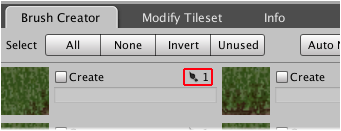

The brush creator tab includes a handy shortcut for quickly navigating to a specific brush
instance for any available tile.

## Just one brush for tile:

Clicking the brush counter will immediately navigate to the brush that is associated with
the tile:

## Multiple brushes for tile:

When there are multiple brush instances for a single tile you can pick the one that you
would like to navigate to from the popup menu:

