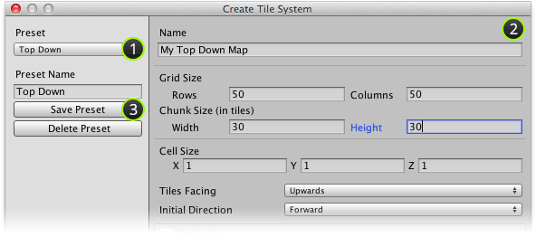

An existing preset can be modified when creating a tile system. Modifications can be then
be saved for future re-use if desired.

## Prerequisite

Ensure that **Create Tile System** window is displayed (see [Creating a Tile System].

## Steps

1. Select the preset that you would like to modify using **Preset** drop-down box.

2. Make required alterations to tile system creation parameters.

3. (Optional) Click **Save Preset** button to save changes to preset.

   This step is optional if the modifications only apply to the tile system that you are
   in the process of creating.

   >
   > **Note** - Changing a preset will **not** cause any changes to be made to previously
   > created tile systems.
   >

## Result

Preset should have been updated with new parameters.

[Creating a Tile System]: ./Creating-a-Tile-System.md
