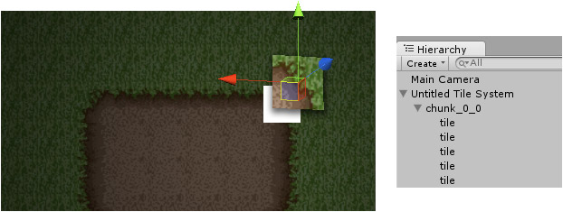

Non-procedural tiles are individual game objects that each render a pre-generated two
triangle plane mesh. Non-procedural tiles can be individually moved, rotated and scaled
using their transform components.

It is important to note that non-procedural tiles can be combined by material on a per
chunk basis when building a tile system; see [Optimization].

[Optimization]: ./Tile-System-Optimization.md
