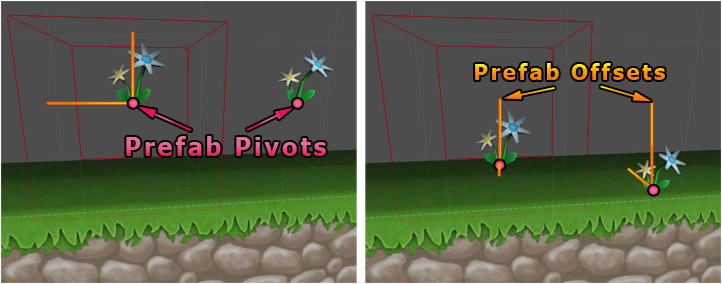

Sometimes you may find that your tiles are do not align in the way that you had expected.
The way in which prefab instances are positioned can be influenced using the transform
properties of tile prefabs themselves.

Whilst it is generally better to fix such errors using your modelling software, it is
often more convenient to solve this using the prefab offset.

For example, the tile offset can be specified by altering the prefab position property
using the **Inspector** window. Rotation and scaling can be altered in a similar way:

>
> **Important** - Ensure that **Apply Prefab Transform** is set for brush using brush
> designer.
>

## Use as Prefab Offset

This utility function aims to make it easier to define prefab offsets for your brushes:

1. Paint tile into the desired grid cell (even though it looks wrong).

2. Select tile prefab instance.

3. Modify position, rotation and scale as needed.

4. Select menu ** | Use as Prefab Offset**.

[Fixing tile offset using "Use as Prefab Offset" (YouTube)](https://www.youtube.com/watch?v=Ta2Q4ssu_u0)
