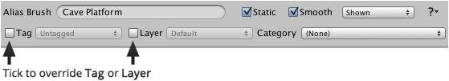
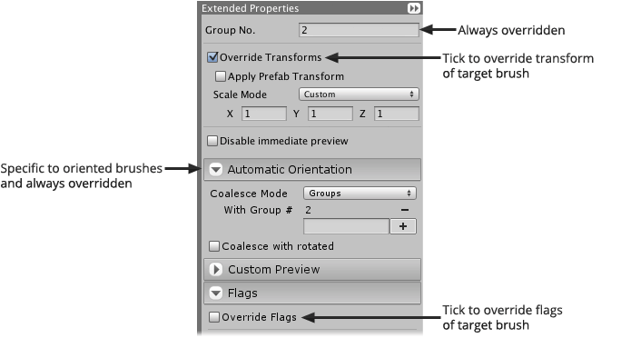

Alias brush designer interface varies depending upon the type of brush which is being
targeted making it possible to override specialized aspects of target brush.

## Common Properties

Common properties can be specified as with most brush types, though as shown below, some
properties must be explicitly overridden by ticking an extra box. This allows you to
selectively override the values of certain properties whilst inherting the values of others.

>
> **Note** - The value of inherited properties reflects changes made to target brush which
> is shown in greyed out fields in designer interface.
>

## Extended Properties

The range of extended properties presented will vary depending upon the type of target
brush. For example, some properties apply to all brush types whilst others only apply to
certain types of brush.

