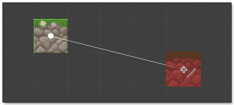
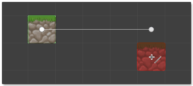

 Single click or drag to paint tiles onto active tile system.

- Use **left mouse** button to paint using primary brush.

- Use **right mouse** button to paint using secondary brush.

>
> **Shortcut Key:** With tile system selected press **B** to select tool.
>

>
> **Tip** - Left click on painted tile to cycle through to next available variation when
> brush radius is set to 1.
>

## Paint Line of Tiles

Hold **Shift** key to paint line of tiles from previously painted tile to cursor. Visual
representation of line is shown whilst key is held as illustrated below:

## Paint Straight Line of Tiles

Hold both **Shift** and **Ctrl** keys to paint horizontal or vertical line of tiles more
easily:

