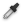

 Pick primary or secondary brush from a previously painted
tile and then automatically switch to the paint tool.

- **Left Click** - Pick primary brush selection from painted tile.

- **Right Click** - Pick secondary brush selection from painted tile.

>
> **Shortcut Key:** With tile system selected press **I** to select tool.
>

## Advanced Options

**Can pick plops**
: Indicates whether brush can be picked from plops when using picker tool. Deselect this
  option when plops are stealing input focus from tile system making it difficult to pick
  from regular tiles.

**Interact with active system only**
: Indicates whether picker tool should only be able to interact with plops that are
  associated with the active tile system.
