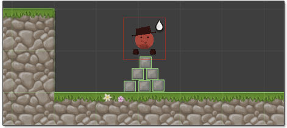
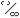
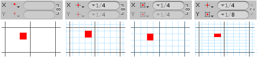

 Plops object somewhere on plane of tile system using brush
but does not assign to data structure of tile system.

- Use **left mouse** button to plop tiles using primary brush.

- Use **right mouse** button to plop tiles using secondary brush.

>
> **Shortcut Key:** With tile system selected press **P** to select tool.
>

>
> **Tip** - Left click on painted plop to cycle through to next available variation.
>

## Alignment on X and Y Axis

Plops can be freely placed or aligned to a subdivision of the active tile system's grid.
Separate alignments can be specified for the X and Y axis though these are linked by
default ().

**Snap Alignment**
: -  **Free** - Free placement of plops.

  -  **Points** - Snap plops to points (where grid
    lines intersect).

  -  - Snap to midpoint of grid cells.

**Snap Grid Spacing**
: When snapping to grid points or cells the spacing between grid cells can be specified
  using one of the following modes which can be selected using the drop-down arrow to left
  of input field.

  - **Fraction of Cell Size** - Make snapping grid relative to cell size of the active
    tile system.

  - **Custom** - Specify custom grid in local space of the active tile system.

  Common presets can also be quickly selected from the drop-down.

## Plopping Overlapping Objects

Hold **Ctrl** key to temporarily disable cycle functionality of plop tool so that you can
plop objects on top of one another.

>
> **Tip** - You may want to consider adjusting the advanced option **Disable cycle function**
> if you rarely use cycle functionality of plop tool.
>

## Advanced Options

**Location**
: Location for new plops:

  - **Group Inside Tile System** - Group plops into game object inside tile system.

  - **Child Of Tile System** - Place plops inside tile system game object.

  - **Scene Root** - Place plops at scene root.

**Disable cycle function**
: Disables cycle functionality of plop making it possible to plop overlapping tiles
  without needing to hold **Ctrl** key.

**Interact with active system only**
: Indicates whether erase and cycle functionality should only be able to interact with
  plops that are associated with the active tile system.

**Hide wireframe outline**
: Indicates whether wireframe outline should be shown to highlight position of plop.
  Wireframe outline is always shown for brushes where immediate previews have been disabled.
