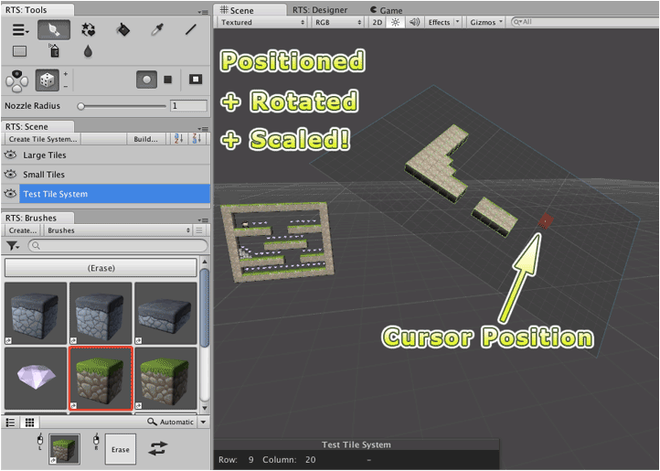

A tile system can be selected using the scene palette or hierarchy window or by clicking
its handle in scene view. Selected tile system can then be transformed using the regular
move, rotate and scale tools provided by Unity.

Once tile system is positioned as desired you can paint on it as desired. It is often
easier to paint using orthographic scene views; though this is entirely a matter of
preference.
		
The illustration below demonstrates a tile system with all three transforms applied in
edit mode. The small red wireframe cube highlights the active tile when painting.

